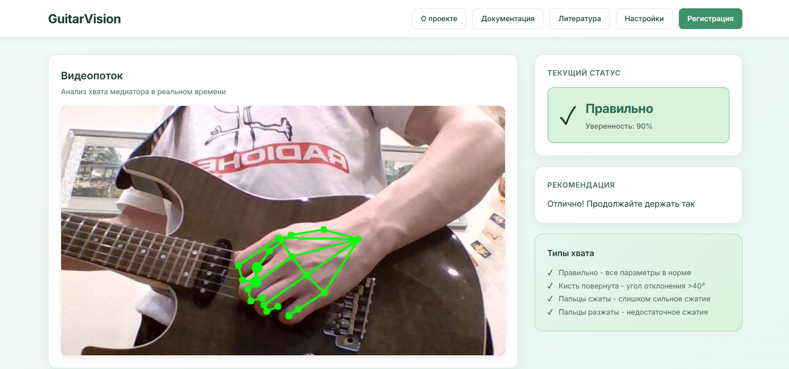
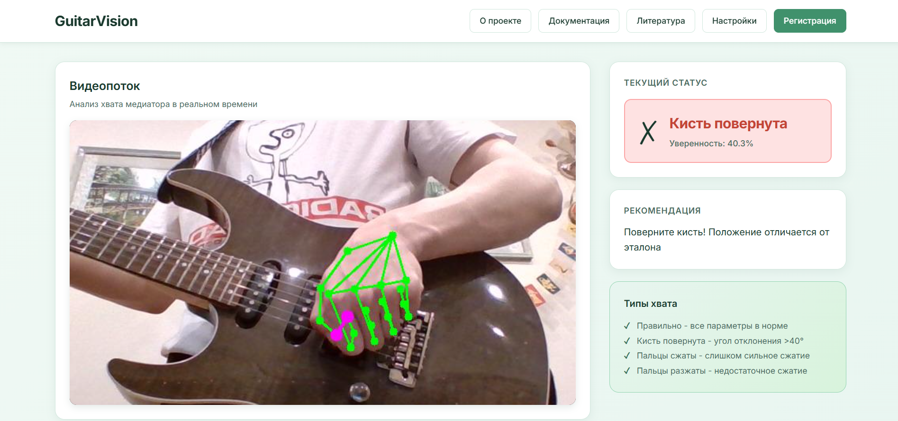
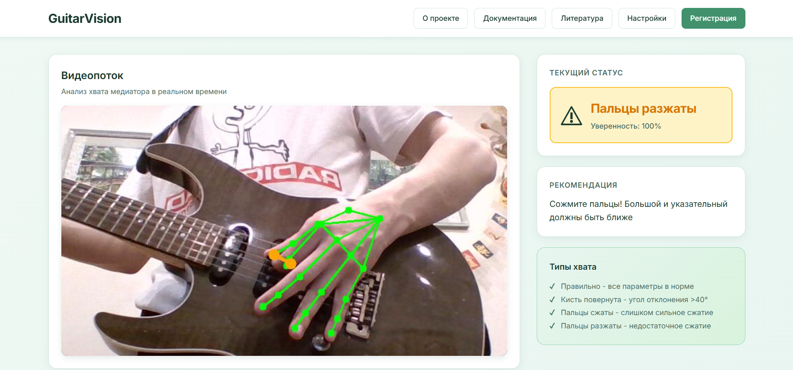

# GuitarVision - Анализ хвата медиатора в реальном времени

## Быстрый старт

### Установка зависимостей

```bash
# Создание виртуального окружения Python 3.12
py -3.12 -m venv venv

# Активация окружения
.\venv\Scripts\Activate.ps1

# Установка зависимостей
.\venv\Scripts\python.exe -m pip install -r requirements.txt
```

### Запуск веб-сервиса (рекомендуется)

```bash
.\venv\Scripts\python.exe app.py ref.jpg
```

Откройте в браузере: http://localhost:5000

**Важно:** Эталонное изображение (ref.jpg) обязательно для корректной работы классификации.

### Запуск десктопного приложения

```bash
.\venv\Scripts\python.exe hand_tracking.py ref.jpg
```

**Управление:**
- `q` - выход
- `s` - сделать скриншот
- `a` - включить/выключить звуковую обратную связь

---

## Описание системы

GuitarVision - система анализа хвата медиатора в реальном времени с использованием компьютерного зрения и машинного обучения.

### Основные возможности

- Real-time анализ положения кисти через веб-камеру
- Масштабо-инвариантная классификация (не зависит от расстояния до камеры)
- 4 типа классификации хвата
- Веб-интерфейс с видеопотоком и метриками
- Десктопное приложение со звуковой обратной связью
- Настраиваемые пороги классификации

### Технологии

- Python 3.12
- MediaPipe - детекция landmarks кисти (21 точка)
- OpenCV - обработка видео
- Flask - веб-сервис
- NumPy - математические вычисления

---

## Демонстрация работы

### Правильный хват

*Все параметры в норме - зеленый статус*

### Неправильный угол кисти

*Кисть повернута - красный статус с рекомендацией*

### Неправильное положение пальцев

*Пальцы разжаты или сжаты - желтый/красный статус*

---

## Типы хвата

Система определяет 4 типа хвата:

1. **Правильно** - все параметры в норме, хват соответствует эталону
2. **Кисть повернута** - угол отклонения кисти превышает 40 градусов
3. **Пальцы сильно сжаты** - средний, безымянный и мизинец сжаты слишком сильно
4. **Пальцы разжаты** - средний, безымянный и мизинец недостаточно согнуты

**Специальный случай:**
- **Кисть не обнаружена** - рука не видна в кадре камеры

---

## Алгоритм классификации

### Приоритет проверок

1. **Угол поворота кисти** (порог: 40 градусов)
   - Вектор от запястья к костяшке указательного пальца
   - Сравнение с эталонным вектором

2. **Сгиб пальцев** (асимметричное окно: 50% / 150%)
   - Используются только 3 пальца: средний, безымянный, мизинец
   - Большой и указательный пальцы НЕ учитываются (держат медиатор)
   - Нижняя граница: эталон × 0.5 (TOO_TIGHT)
   - Верхняя граница: эталон × 2.5 (FINGERS_OPEN)

### Масштабо-инвариантность

Все метрики нормализуются по размеру ладони:

```
hand_size = расстояние(запястье, костяшка_среднего_пальца)
normalized_metric = raw_metric / hand_size
```

Преимущества:
- Не зависит от расстояния до камеры
- Не зависит от размера руки
- Стабильные пороги для всех пользователей

---

## Веб-интерфейс

### Структура интерфейса

**Header:**
- Логотип GuitarVision (слева)
- Навигационные кнопки: О проекте, Документация, Литература, Настройки, Регистрация

**Основной контент (двухколоночная компоновка):**
- Слева: Видеопоток с камеры (формат 16:9)
- Справа: Панель анализа с тремя карточками
  - Статус хвата (с иконкой и уверенностью)
  - Рекомендация (показывается при необходимости)
  - Информационная карточка (типы хвата)

**Footer:**
- О проекте
- Технологии (Python, MediaPipe, OpenCV, Flask)
- Ресурсы (Документация, GitHub, FAQ)
- Контакты (Поддержка, обратная связь)

### Дизайн

**Цветовая палитра (природная тема):**
- Фон: градиент от светло-мятного (#f0f9f4) к мятно-зеленому (#e8f5f0)
- Карточки: белый фон (#ffffff)
- Текст: темно-зеленый (#1a3a2e)
- Акценты: зеленый (#40916c)

**Статусы:**
- Правильно: зеленый фон (#d8f3dc)
- Предупреждение: желтый фон (#fef3c7)
- Ошибка: красный фон (#fee2e2)

---

## Структура проекта

```
GuitarVision/
├── app.py                    # Flask веб-сервис (основной)
├── hand_tracking.py          # Десктопное приложение
├── grip_classifier.py        # Классификатор хвата
├── audio_feedback.py         # Звуковая обратная связь
├── hands.task                # Модель MediaPipe (gitignored)
├── requirements.txt          # Зависимости Python
├── templates/
│   └── index.html           # Веб-интерфейс
├── venv/                    # Виртуальное окружение
├── DOCUMENTATION.md         # Полная документация
└── README.md                # Этот файл
```

---

## Оптимизация производительности

Система оптимизирована для работы в реальном времени:

- Кэширование результатов MediaPipe (~40ms экономии)
- Одно чтение камеры за кадр (~33ms экономии)
- Удаление избыточных вычислений (~10-15ms экономии)
- Polling интервал: 100ms (было 500ms)

**Результат:**
- Задержка: ~80-100ms на кадр (было ~396ms)
- FPS: ~10-12 (было ~2.5)
- Общее улучшение: 4-5x

---

## Настройка порогов

Для изменения порогов классификации отредактируйте `grip_classifier.py`, метод `_classify()` (около строки 403):

```python
rotation_threshold = 40      # Угол поворота (градусы)
curl_tolerance_tight = 0.50  # Для TOO_TIGHT (50%)
curl_tolerance_open = 1.50   # Для FINGERS_OPEN (150%)
```

---

## Решение проблем

### Кисть не обнаружена

**Причины:**
- Рука не в кадре
- Плохое освещение
- Рука слишком далеко от камеры

**Решение:**
- Поднесите руку ближе к камере
- Улучшите освещение
- Убедитесь, что вся кисть видна

### Постоянно показывает "Кисть повернута"

**Причина:** Положение кисти сильно отличается от эталона

**Решение:**
- Создайте новое эталонное изображение в вашем текущем положении
- Или увеличьте `rotation_threshold` в `grip_classifier.py`

### Низкий FPS

**Причины:**
- Слабый процессор
- Другие приложения используют камеру
- Высокое разрешение камеры

**Решение:**
```python
# Уменьшите разрешение камеры в app.py
camera.set(cv2.CAP_PROP_FRAME_WIDTH, 640)
camera.set(cv2.CAP_PROP_FRAME_HEIGHT, 480)
```

### hands.task not found

**Причина:** Модель MediaPipe отсутствует

**Решение:**
- Скачайте модель с MediaPipe Models
- Поместите файл `hand_landmarker.task` в корень проекта
- Переименуйте в `hands.task`

---

## Системные требования

- ОС: Windows 10/11 (рекомендуется), Linux, macOS
- Python: 3.12+
- RAM: 2GB минимум, 4GB рекомендуется
- Камера: Любая веб-камера с разрешением 640×480 или выше
- Процессор: Intel Core i3 или аналог (для real-time обработки)

---

## Дополнительная информация

Для подробной документации см. `DOCUMENTATION.md`
